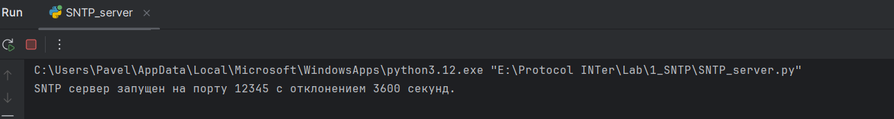
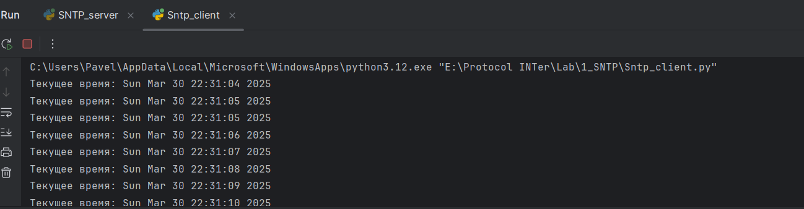
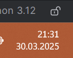
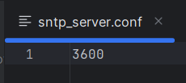
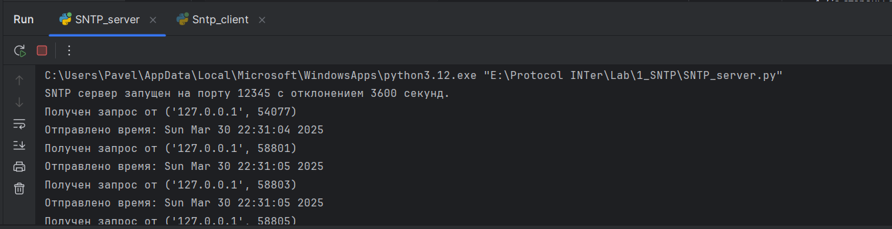

# SNTP Сервер с настраиваемым смещением времени

Этот SNTP сервер позволяет получать текущее время с заданным смещением. Сервер запрашивает точное время у внешнего источника (`time.windows.com`) и корректирует его на значение, указанное в конфигурационном файле.

---

## Реализовано
- **Смещение времени**
- **Полный SNTP-пакет**
- **Обработка ошибок**:
   - Отсутствие интернета.
   - Таймауты запросов.
   - Некорректные DNS-имена.
   - Недопустимые запросы от клиентов.
   - Ошибки в работе с конфигурационным файлом

---

## Запуск и Проверка работы
1. Установить зависимости:
  ```bash
  pip install -r requirements.txt
  ```
2. Запустить файл **SNTP_server.py:**


3. Для проверки запустить файл **Sntp_client.py** и увидим серию выводов от клиента, как видим сервер врет на час как и указано в конфигурационном файле:

     

4. Со стороны сервера также можем наблюдать серию выводов подтверждающих работоспособность:

